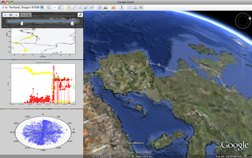

# Google Earth Toolbox
[on matlab central](https://www.mathworks.com/matlabcentral/fileexchange/12954-google-earth-toolbox)

The Google Earth Toolbox leverages the intuitive interactive virtual globe interface provided by Google Earth, providing programatic tools useful in spatio-temporal analysis.

